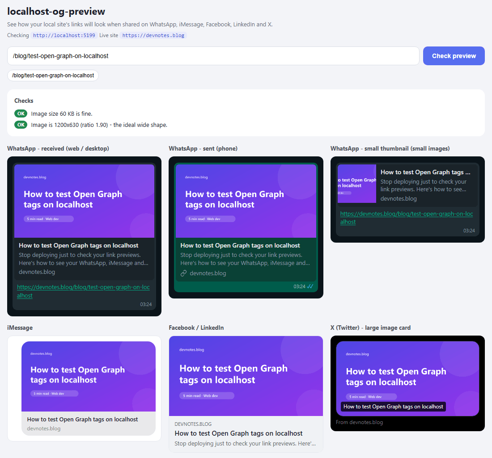
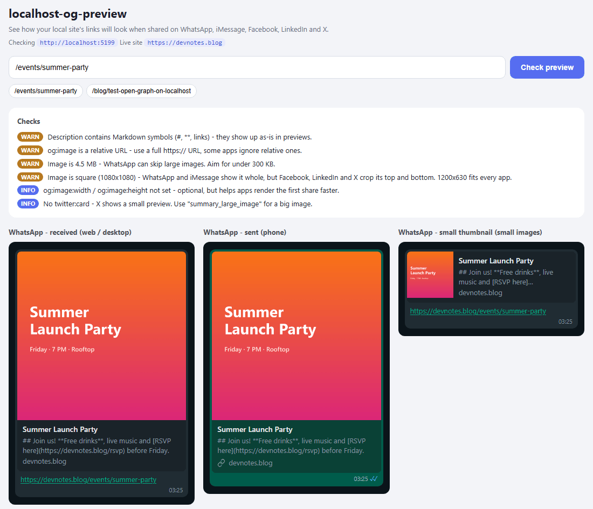

# localhost-og-preview — Test Open Graph & Link Previews on Localhost

**See how your links will look on WhatsApp, iMessage, Facebook, LinkedIn and X (Twitter) — before you deploy.**

[](https://www.npmjs.com/package/localhost-og-preview)
[](https://www.npmjs.com/package/localhost-og-preview)


```bash
npx localhost-og-preview --target http://localhost:3000 --open
```

You built a page, added your `og:image`, `og:title` and `og:description`… and now you want to know: **what will it look like when someone shares the link?**

The usual answer is "deploy it and find out", because WhatsApp, the Facebook Sharing Debugger, the LinkedIn Post Inspector and X can't open `localhost`. That's slow and annoying.

**`localhost-og-preview` fixes that.** It's a tiny tool that runs on your computer, reads your local pages exactly like the link-preview bots do, and shows you the preview cards right away, plus a list of anything that's broken.

✅ Test Open Graph tags on localhost &nbsp;·&nbsp; ✅ Preview `og:image` locally &nbsp;·&nbsp; ✅ WhatsApp, iMessage, Facebook, LinkedIn & X mock-ups &nbsp;·&nbsp; ✅ Zero dependencies &nbsp;·&nbsp; ✅ Works with any framework



<sub>A blog post running on `localhost`, previewed as a WhatsApp message (received and sent), WhatsApp thumbnail, iMessage bubble, Facebook / LinkedIn post and X card.</sub>

---

## Why you'll like it

- 🔌 **Nothing to install.** No packages, no accounts, no API keys. Just Node.js.
- 🧩 **Works with any website:** Next.js, React (Vite / Create React App), Vue, Nuxt, Svelte / SvelteKit, Astro, Angular, Remix, Gatsby, Django, Rails, Laravel, plain HTML… if it runs on a local URL, it works.
- 👀 **Real-looking previews** for WhatsApp (received, sent and small thumbnail), iMessage, Facebook / LinkedIn and X.
- 🩺 **Tells you what's wrong** in plain words: missing tags, images that are too big or won't load, images that will get cropped, and more.
- 🔒 **Stays on your machine.** It only listens on your own computer.

---

## Before you start

You need **Node.js 18 or newer**. Not sure if you have it? Open a terminal and type:

```bash
node -v
```

- See something like `v18.17.0` or `v20.11.1`? You're good to go. 🎉
- See `command not found`, or a number lower than 18? Download the **LTS** version from [nodejs.org](https://nodejs.org), install it, then close and reopen your terminal.

> 💡 **What's a terminal?** On Windows it's **PowerShell** or **Command Prompt** (search for it in the Start menu). On Mac it's the **Terminal** app. In VS Code, use **Terminal → New Terminal**.

---

## Quick start (3 steps, about 2 minutes)

### 1. Start your website like you normally do

For example `npm run dev`. Keep it running and note the address it shows, like `http://localhost:3000`.

### 2. Start the tool

Open a **second** terminal window (leave your website running in the first one) and run:

```bash
npx localhost-og-preview --target http://localhost:3000 --open
```

That's the whole install: `npx` downloads it and runs it in one go. The first time it may ask *"Ok to proceed? (y)"*; press **y** and Enter.

> Use your own website's address after `--target`. Not sure which one? See [Which address is my site on?](#which-address-is-my-site-on)

> 💡 The tool keeps running in that terminal (the blinking cursor is normal). Press **Ctrl + C** there when you're done.

### 3. Check a page

Your browser opens **http://localhost:4545**. Type a page of your site into the box, like `/` or `/blog/my-first-post`, and click **Check preview**.

That's it. You'll see how the link looks in every app, plus what to fix. 🚀

---

## What you'll see

1. **Checks:** a short list marked **FIX**, **WARN**, **INFO** or **OK**. Fix the red ones first.
2. **Preview cards:** how your link appears in:
   - WhatsApp: a message you **received** (web / desktop), a message you **sent** (phone), and the **small thumbnail** version
   - iMessage
   - Facebook / LinkedIn
   - X (Twitter): the large or small card, depending on your `twitter:card` tag
3. **Share image:** your `og:image` with its real size, file size and type.
4. **Tags:** every Open Graph and Twitter Card tag your page sends, and which ones are missing.

The last 8 pages you checked show up as buttons, so re-checking after a fix is one click.

> 💡 **Shortcut:** open `http://localhost:4545/?url=/blog/my-first-post` and it checks that page straight away. Handy for bookmarking the pages you test most.

---

## Which address is my site on?

Use whatever address your dev server prints when it starts. If you don't know, these are the usual defaults:

| Framework | Usual address |
|---|---|
| Next.js, Remix (classic), Nuxt, Create React App, Rails | `http://localhost:3000` |
| Vite (React, Vue, Svelte), SvelteKit | `http://localhost:5173` |
| Astro | `http://localhost:4321` |
| Angular | `http://localhost:4200` |
| Django | `http://localhost:8000` |
| Laravel (`php artisan serve`), Gatsby | `http://localhost:8000` |
| Live Server (VS Code) | `http://127.0.0.1:5500` |

---

## Testing before you deploy: `--site-url`

Most sites put the **full live address** in their image tag, like:

```html
<meta property="og:image" content="https://mysite.com/images/share.png" />
```

That image might not exist on the live site yet, because you just made it! Add your live address with `--site-url`, and the tool loads those images from your **local** site instead:

```bash
npx localhost-og-preview --target http://localhost:3000 --site-url https://mysite.com --open
```

Bonus: you can now also paste live links (like `https://mysite.com/about`) into the box, and it checks your local version of that page.

---

## All options

| Option | Default | What it does |
|---|---|---|
| `--target <url>` | `http://localhost:3000` | Your local website. |
| `--site-url <url>` | *(none)* | Your live website. Image URLs pointing to it are loaded from `--target`. |
| `--port <number>` | `4545` | The port this tool runs on. |
| `--open` | off | Opens the tool in your browser automatically. |
| `--help` | | Shows all of this in the terminal. |

You can also set them as environment variables: `OG_PREVIEW_TARGET`, `OG_PREVIEW_SITE_URL`, `OG_PREVIEW_PORT`.

### Install it permanently (optional)

`npx` is all you need, but if you use it a lot you can install it once:

```bash
npm install -g localhost-og-preview
```

Now you can start it from **any** folder with just:

```bash
localhost-og-preview --target http://localhost:3000 --open
```

### Add it to your project (optional)

Want your whole team to have it? Add it as a dev dependency:

```bash
npm install --save-dev localhost-og-preview
```

Then add a script to your `package.json`:

```json
"scripts": {
  "og": "localhost-og-preview --target http://localhost:3000 --open"
}
```

And run `npm run og` whenever you want to check your previews.

### Run it from the source code

```bash
git clone https://github.com/marajanim/localhost-og-preview.git
cd localhost-og-preview
node bin/localhost-og-preview.js --target http://localhost:3000 --open
```

---

## What the checks mean

Here it catches five problems on one page: Markdown in the description, a relative image URL, a 4.5 MB image, a square image that Facebook, LinkedIn and X will crop, and a missing `twitter:card`.



| Check | What it means | How to fix it |
|---|---|---|
| **No og:image** | Your link will be shared without a picture. | Add `<meta property="og:image" content="https://...">`. |
| **Image did not load** | The image URL is wrong, private, or the server is down. | Open the image URL in your browser and make sure it loads. |
| **Image is too big** | WhatsApp often skips images over a few hundred KB, and almost always skips ones over 5 MB. | Compress it, aim for **under 300 KB**. |
| **Square or tall image** | WhatsApp and iMessage show it whole, but Facebook, LinkedIn and X crop the top and bottom. | Use **1200 × 630** pixels. |
| **Image is small** | It looks blurry in big previews. | Use at least **1200 × 630**. |
| **Relative og:image URL** | `/share.png` instead of `https://mysite.com/share.png`. Some apps ignore it. | Always use a full `https://` URL. |
| **Markdown in the description** | Symbols like `##` and `**` show up as plain text in previews. | Strip Markdown before putting text in `og:description`. |
| **No twitter:card** | X shows a small preview instead of a big image. | Add `<meta name="twitter:card" content="summary_large_image">`. |
| **Page returned 404** | The app will preview an error page. | Check the page address. |

---

## Troubleshooting

**"Could not reach http://localhost:3000"**
Your website isn't running, or it's on a different address. Start it first, then check the address it prints and use that after `--target`.

**"Port 4545 is already in use"**
The tool is already running in another window, or something else uses that port. Close the other one, or pick another port: `--port 4546`.

**The page takes ages to load the first time**
That's normal for dev servers (especially Next.js): the first visit to each page has to compile it. The next check is fast.

**I fixed my tags but the real WhatsApp still shows the old preview**
Real apps cache previews for a while. After you deploy, add something like `?v=2` to the end of the link, or refresh it in Facebook's Sharing Debugger / LinkedIn's Post Inspector.

---

## FAQ

**How do I test Open Graph tags on localhost?**
Start your dev server, run `localhost-og-preview` next to it, and type a page path. It fetches the page like a link-preview bot, reads the Open Graph and Twitter Card tags, and shows how the link will look in each app.

**Can I use the Facebook Sharing Debugger on localhost?**
No. Facebook's debugger, WhatsApp, LinkedIn and X fetch your page from their own servers, which can't reach your computer. This tool runs on your computer, so it can. (You *can* use a tunnel like ngrok, but then you need an account and a public URL; this tool needs neither.)

**How do I preview a WhatsApp link preview before deploying?**
Run this tool and look at the WhatsApp cards. They show the received, sent and small thumbnail styles, with your image in the same shape WhatsApp uses.

**Why is my WhatsApp link preview not showing the image?**
The usual reasons: the `og:image` file is too big (several MB), the image URL isn't public or doesn't load, or it's a relative URL. This tool flags all three.

**What size should an og:image be?**
**1200 × 630 pixels** (a 1.91:1 ratio), ideally **under 300 KB**. That shape looks right everywhere; square and tall images get cropped on Facebook, LinkedIn and X.

**Does it work with Next.js `generateMetadata` and `opengraph-image`?**
Yes. It reads the final HTML your dev server sends, so it works however your meta tags are made: Next.js, `react-helmet`, Nuxt `useHead`, plain HTML, anything.

**Does it send my pages anywhere?**
No. Everything happens on your computer. It only fetches the pages and images you ask it to check.

**Is it exactly like the real apps?**
It's close, not pixel-perfect. Apps change their design now and then, and phones and desktops differ a little. Use it to catch problems early, then do one final check after you deploy.

---

## How it works (for the curious)

1. You type a page; the tool asks your local site for it, identifying itself like WhatsApp and Facebook's link-preview bots (`facebookexternalhit`).
2. It reads the `<title>`, Open Graph (`og:*`) and Twitter Card (`twitter:*`) tags from the page's `<head>`.
3. It downloads your `og:image`, reads its size straight from the file (PNG, JPEG, GIF and WebP, no image library needed), and runs the checks.
4. The page shows everything as preview cards.

```
bin/localhost-og-preview.js   the command you run
src/server.js                 tiny local web server (localhost only)
src/inspect.js                fetches the page, reads its tags, runs the checks
src/meta.js                   reads <meta> tags from HTML
src/imageSize.js              reads image sizes without any library
src/ui.html                   the page you see in the browser
```

---

## Contributing

Found a bug, or want a preview for another app (Slack, Discord, Telegram…)? [Open an issue](https://github.com/marajanim/localhost-og-preview/issues) or send a pull request. Ideas are welcome!

If this tool saved you a deploy or two, a ⭐ on GitHub helps other developers find it.

## License

[MIT](LICENSE). Free to use in personal and commercial projects.
